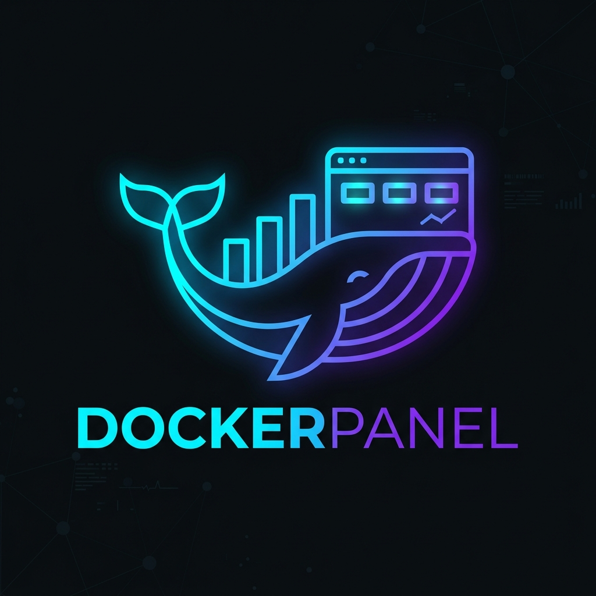

# 🐳 DockerPanel

**DockerPanel** — это полнофункциональная, современная веб-панель управления Docker-контейнерами с открытым исходным кодом. Разработана для обеспечения простого, интуитивно понятного и красивого интерфейса для управления вашей инфраструктурой Docker.



## 🌟 Возможности

- 📊 **Мониторинг в реальном времени**: Отслеживание потребления CPU, RAM, Network и Disk с помощью динамических графиков (Chart.js).
- 🖥️ **Встроенный веб-терминал**: Полноценный терминал (xterm.js) с прямым WebSocket подключением к вашим контейнерам, работающий в удобном модальном окне с сохранением сессии.
- 📦 **Управление контейнерами**: Создание, запуск, остановка, перезагрузка и удаление контейнеров в один клик.
- 🖼️ **Управление образами**: Скачивание новых образов, удаление неиспользуемых.
- 🌐 **Сети и Volumes**: Полный контроль над виртуальными сетями и постоянными томами Docker.
- 📋 **Шаблоны**: Огромная библиотека готовых шаблонов (Ubuntu, Nginx, Node.js, MySQL, WordPress, Nextcloud и др.) для развертывания в один клик.
- 💾 **Автоматическое резервное копирование**: Встроенная система бэкапов контейнеров и томов по расписанию.
- 📁 **Файловый менеджер**: Встроенный редактор (CodeMirror) файлов внутри контейнеров.
- 🔄 **Автообновление**: Система OTA-обновлений (One-Click Update) прямо из веб-интерфейса.

## 🚀 Установка (Установка в 1 клик)

Для установки DockerPanel на свежий сервер (Ubuntu/Debian) выполните следующую команду:

```bash
curl -sSL https://raw.githubusercontent.com/GrinRonm/dokerpanel/main/scripts/install.sh | sudo bash
```

Скрипт автоматически:
1. Установит необходимые пакеты (Nginx, PHP 8.x, SQLite3, Python 3, Docker).
2. Склонирует репозиторий.
3. Настроит права доступа и базу данных.
4. Создаст Nginx-конфигурацию.
5. Запустит фоновые сервисы (включая WebSocket-терминал).

После завершения установки панель будет доступна по IP-адресу вашего сервера.
**Логин по умолчанию**: `admin`
**Пароль по умолчанию**: `admin`
*(Обязательно смените пароль при первом входе в систему!)*

## 🛠️ Стек технологий

- **Backend**: PHP 8.x (Custom MVC Framework) + Python 3 (WebSocket Server)
- **Frontend**: HTML5, CSS3, Vanilla JS
- **База данных**: SQLite3
- **Веб-сервер**: Nginx + PHP-FPM
- **Интеграция с Docker**: Прямое взаимодействие через UNIX-сокет (`/var/run/docker.sock`)

## 📂 Структура проекта

```text
/
├── app/                  # PHP Классы (Контроллеры, Модели, Сервисы, Middleware)
├── config/               # Настройки приложения и маршрутизатор
├── database/             # Схемы БД и сиды (начальные данные)
├── public/               # Публичная директория (CSS, JS, картинки)
├── scripts/              # Скрипты установки (install.sh) и обновления (update.sh)
├── storage/              # Логи, бэкапы, локальная база SQLite
├── views/                # HTML/PHP Шаблоны страниц
├── websocket/            # Python WebSocket-сервер для терминала
└── index.php             # Единая точка входа
```

## 🔄 Обновление

Система оснащена функцией автоматического обновления. Зайдите в **Настройки** -> **Обновление** и нажмите «Обновить сейчас», если доступна новая версия.
Система сама скачает последние коммиты из ветки `main`, обновит файлы, сбросит кэш и перезапустит сервисы.

## 📄 Лицензия

Этот проект распространяется под лицензией MIT. Подробности см. в файле [LICENSE](LICENSE).
